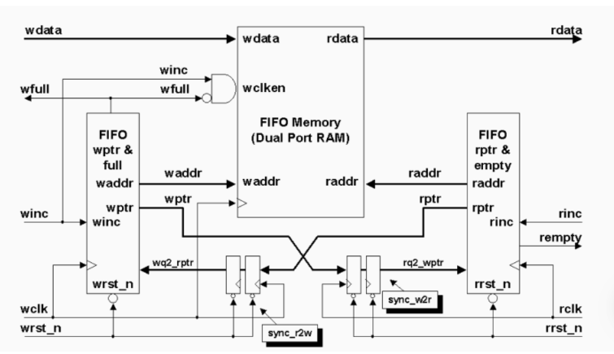
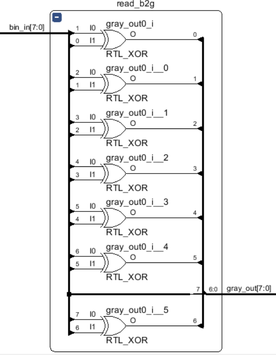
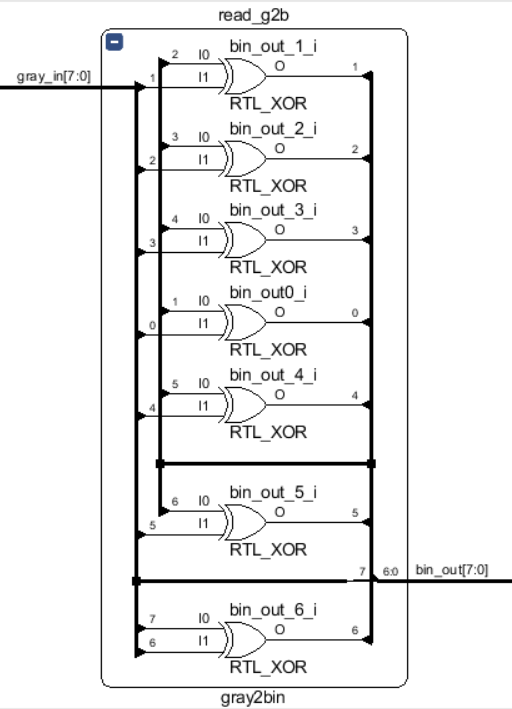
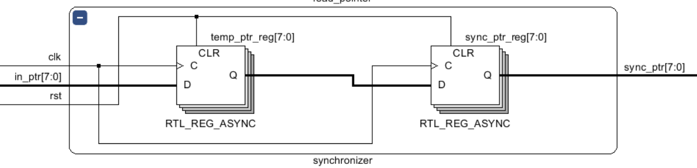
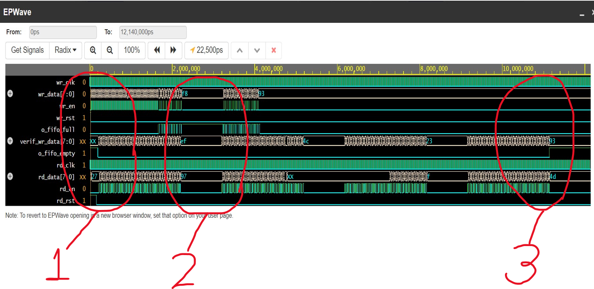
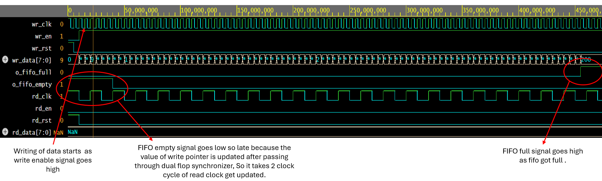
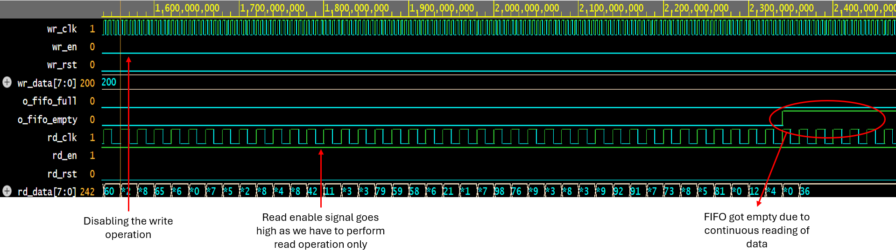
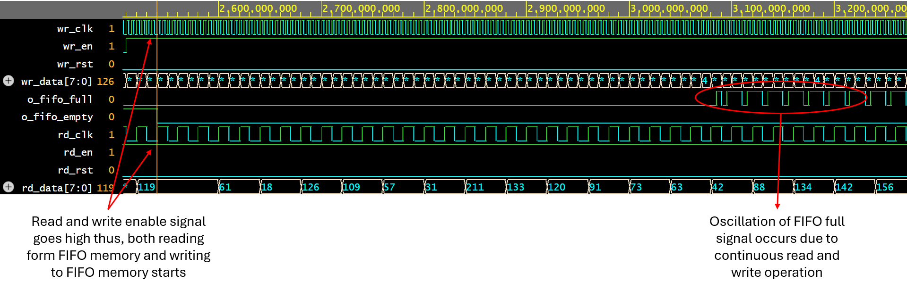

# Minor Project: Asynchronous FIFO

This Project involve designing of an asynchronous FIFO with the following specifications.

- Design Specifications:
    - Transmitter A transmits data (burst of size 120), at 200MHz clock frequency.
    - Receiver B receives the data at 50MHz clock frequency.
    - No idle cycles between read and write are involved.

- Write interface:
    - wr_clk : write clock (200MHz)
    - wr_en: active high enable signal for the write operation to occur
    - wr_data: 8-bit data coming from the transmitter
    - wr_rst: active high reset signal to reset the write pointer involved, note, you do not reset the contents of the memory.

- Read interface:
    - rd_clk: read clock (50 MHz)
    - rd_en: active high enable signal for read operation to occur
    - rd_data: 8-bit data going to the receiver
    - rd_rst: active high reset signal to reset the read pointer involved.

- FIFO status interface:
    - o_fifo_full: goes high when FIFO is full. No more data writes are possible in that case.
    - o_fifo_empty: goes high when FIFO is empty. No more data reads are possible in that case.


## Asynchronous FIFO
An Asynchronous FIFO (First-In, First-Out) is a type of digital circuit used in electronic design to manage data transmission between two asynchronous clock domains. It stores data temporarily, allowing data to be transferred from one clock domain to another without synchronization issues. Unlike synchronous FIFOs, asynchronous FIFOs do not rely on a common clock signal between the input and output sides, making them suitable for interfacing between systems with different clock frequencies or sources.

## Block Diagram

<p align="center">
  
</p>

### Binary to Gray Convertor
A Binary to Gray code converter is a logical circuit that is used to convert the binary code into its equivalent Gray code.

<p align="center">
  
</p>

### Gray to Binary Converter
A Gray to Binary Converter is a logical circuit that is used to convert the Gray code into its equivalent binary code.

<p align="center">
  
</p>

### Dual Flop Synchronizer
A Dual flip-flop synchronizer is a more reliable synchronizer design that consists of two cascaded flip-flops that sample the CDC signal with the destination clock. This design can reduce the risk of metastability by adding a buffer stage between the CDC signal and the destination logic.

<p align="center">
  
</p>

### Read Handler
This module deals with the updating of read pointer value and generate the fifo empty signal.

<p align="center">
  
</p>

### Write Handler
This module deals with the updating of write pointer value and generate the fifo full signal.

<p align="center">
  
</p>


## Directory structure

```
├── Asynchronous_FIFO_TB.sv
├── Asynchronous_FIFO.v
├── mem_module.v
├── Readme.md
├── read_handler.v
├── synchronizer.v
├── bin2gray.v
├── gray2bin.v
└── write_handler.v
```

- **Readme.md**- This markdown file has the project report.
- **Asynchronous_FIFO.v**- This is the top module, This has instantiation of `mem_module.v` `read_handler.v` `synchronizer.v` `bin2gray.v` `write_handler.v` `bin2gray.v`.
- **Asynchronous_FIFO_TB.v**- This is the verilog file to test the FIFO.
- **memory.v**- This memory array use to temporarly store the data.
- **synchronizer.v**- They are made of 2 D Flip Flop’s.As the FIFO is operating at 2 different clock domains so there is a need to synchronize the pointer value.
- **bin2gray.v**- This module converted pointer value to gray code.
- **gray2bin.v**- This module coverts the gray coded value to binary. 
- **read_handler.v**- This module is responsible handling of read pointer and generate the fifo empty signal.
- **write_handler.v**- This module is responsible handling of write pointer and generate the fifo full signal.

## Schematic diagram
<p align="center">
  
</p>

## FIFO Depth Calculation

  Frequency of Write clock = 200 MHz
  Frequency of Read clock = 50 MHz
  Burst Size = 120

  Time period of Write clock = 5 nsec
  Time period of Read clock = 20 nsec

  Time to send a burst = 120*5 = 600 nsec
  Number of data that can be read in 600 nsec  = 600/20 = 30

  Number of bytes need to store in FIFO = 120 - 30 = 90

  FIFO Depth = 90


## Simulation Waveform-

<p align="center">
  
</p>

**Explanation:**
- Section 1 : Write Operation
- Section 2 : Read Operation
- Section 3 : Both Read and Write Operation

### Section 1
When write enable signal goes high the FIFO starts writing the incoming data from input wr_data pin onto the memory until the memory got full.

<p align="center">
  
</p>

### Section 2
When read enable signal goes high FIFO start reading the data stored in the memory through output pin until it got empty.

<p align="center">
  
</p>

### Section 3
This section shows simultenous reading and writing of data as both the read and write enable signal goes high.
<p align="center">
  
</p>