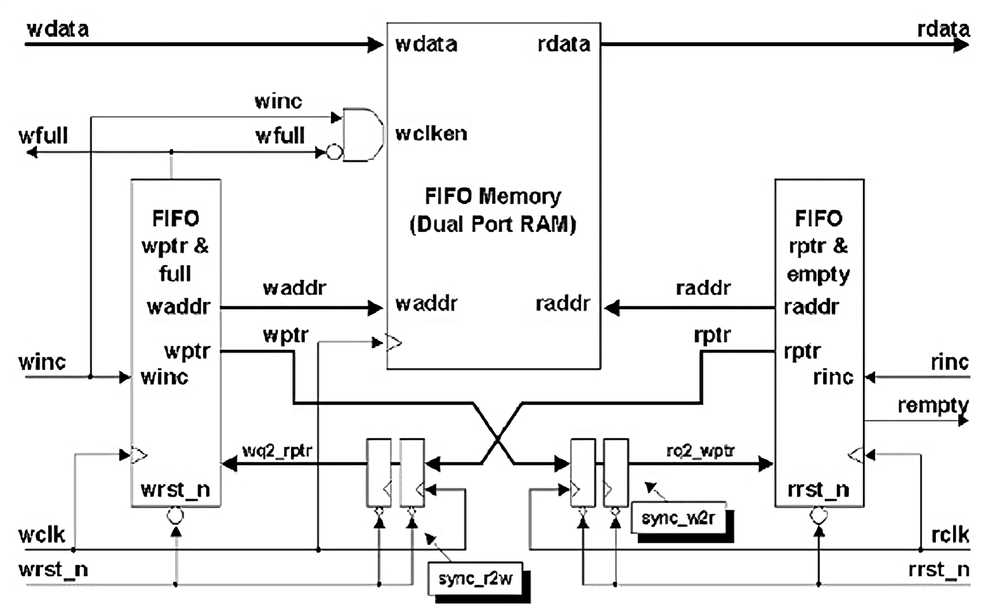
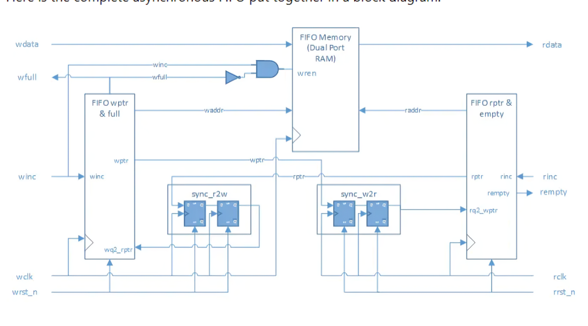
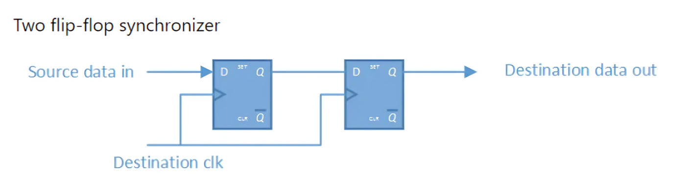
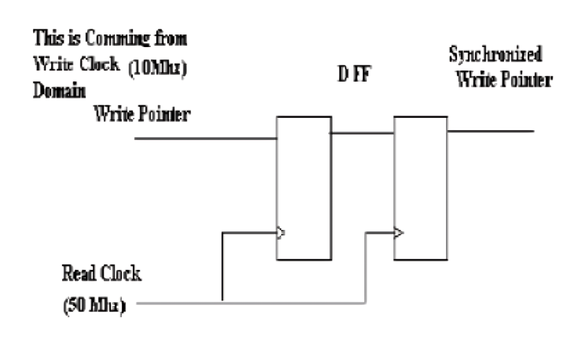
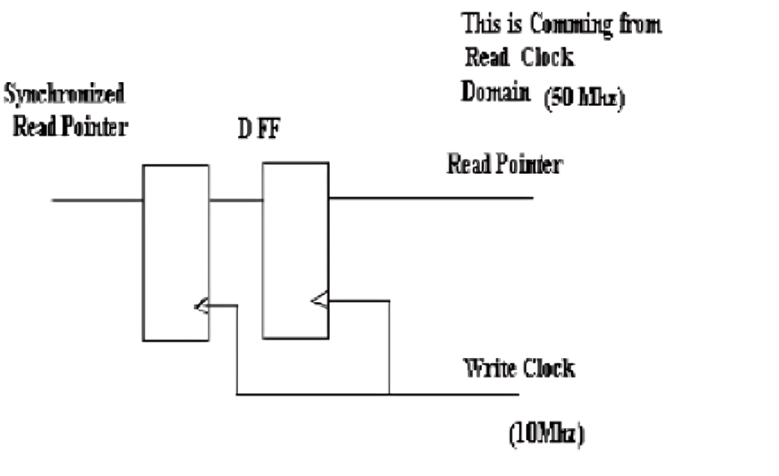
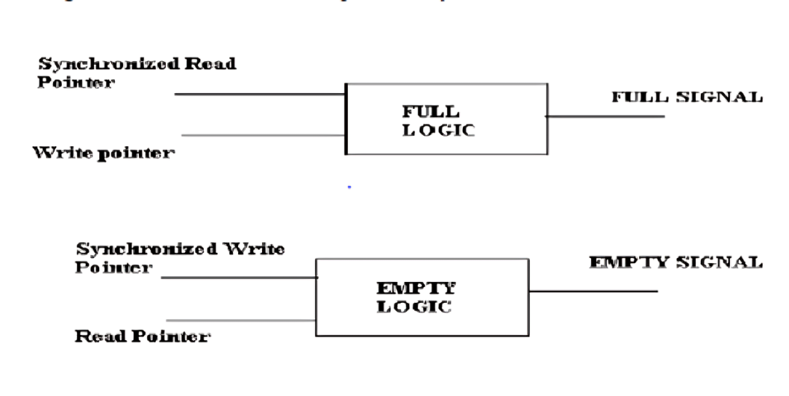

# Asynchronous FIFO
in this design all parts are desgin in different module. Here have two sunchronizer module for wrt synchronizer and read synchroniser. one fifo module one top module one module for full condition and one empty condition.
And the testbench is written in system verilog.
and also in verilog

# contents
Introduction 

FIFO structure

Architecture

Asynchronous FIFO Pointers

Synchronizers & Binary Gray Counter

Full & Empty Logic Block

outputs

simulation

# Introduction
FIFO-Every memory in which the data word that is written in first also comes out first when the memory is read is a first-in first-out memory.

An asynchronous FIFO refers to a FIFO design where data values are written sequentially into a FIFO buffer using one clock domain, and the data values are sequentially read from the same FIFO buffer using another clock domain, where the two clock domains are asynchronous to each other. 

One common technique for designing an asynchronous FIFO is to use Gray code pointers that are synchronized into the opposite clock domain before generating synchronous FIFO full or empty status signals.

  

# FIFO Structure

# Architecture

# Asynchronous FIFO Pointers

Write Pointer:

The write pointer always points to the next word to be written; therefore, on reset, both pointers are set to zero, which also happens to be the next FIFO word location to be written

Read Pointer:

The read pointer always points to the current FIFO word to be read. The fact that the read pointer is always pointing to the next FIFO word to be read means that the receiver logic does not have to use two clock periods to read the data word.

Synchroniser using two flip flop

# Synchronizers & Binary Gray Counter

Synchronizers are very simple in operation; they are made of 2 D Flip Flop’s.As the FIFO is operating at 2 different clock domains so there is a need to synchronize the Write and Read pointers for generating empty and full logic which in turn is used for addressing the FIFO memory.

The Figure below shows how synchronization takes place; the logic behind this is very simple

We need to design a counter which can give Binary and Gray output’s, the need for Binary counter is to address the FIFO MEMORY i.e. Write and Read address. And the need of Gray counter is for addressing Read and Write pointers.

# Full & Empty Logic Block

When the status counter reaches the maximum FIFO depth it will assert FIFO full signal and when its value is zero it will assert FIFO empty signal

# OUTPUTS------

# simulation waveform-

